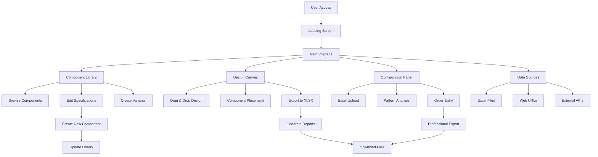
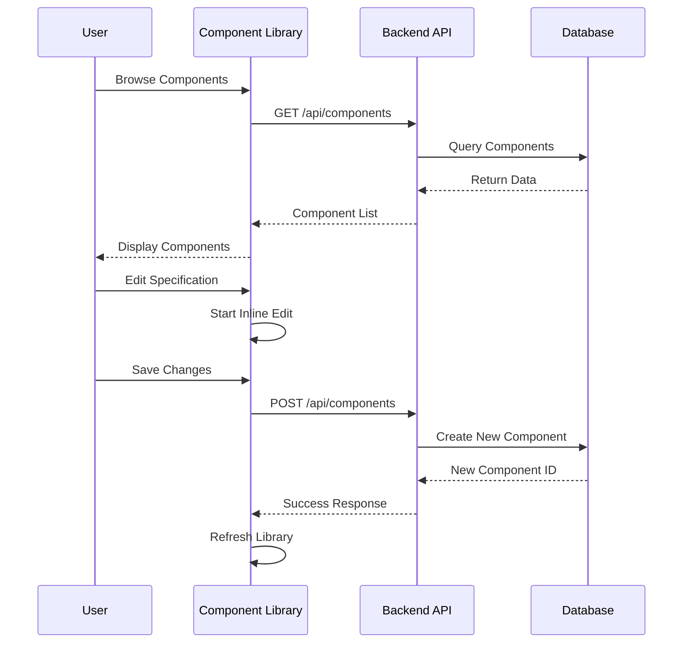
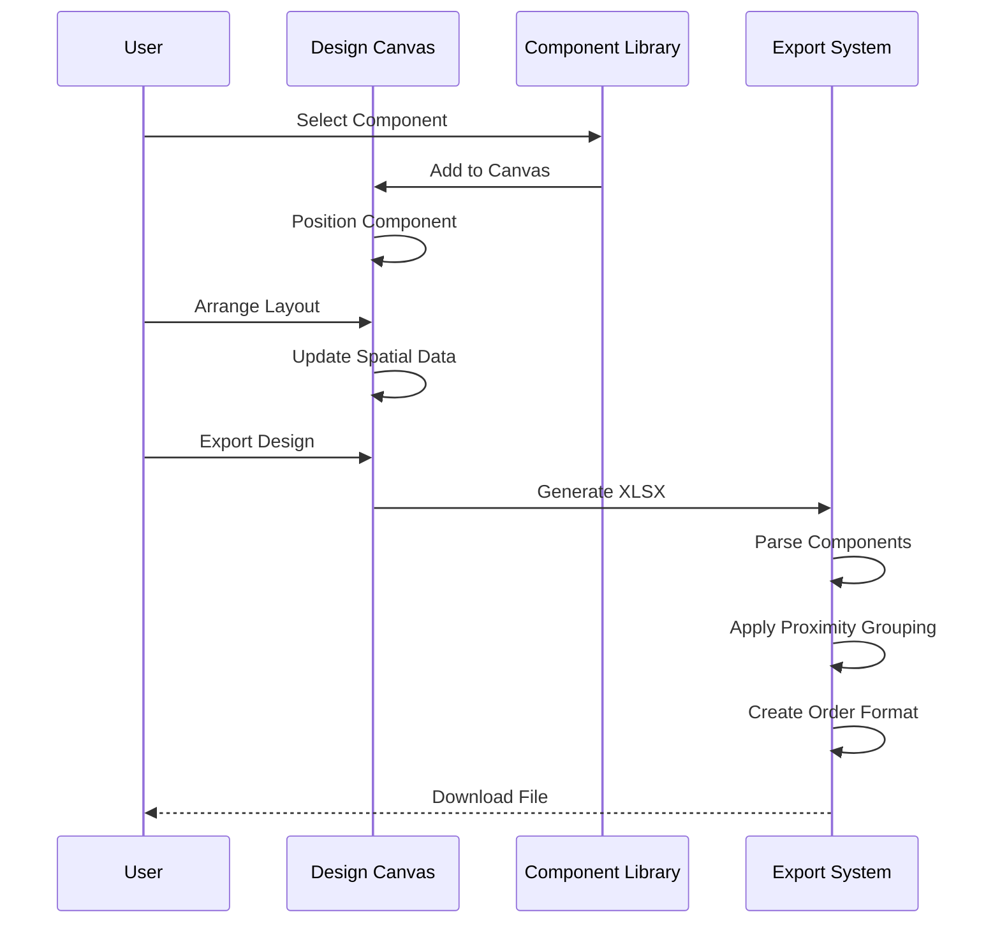
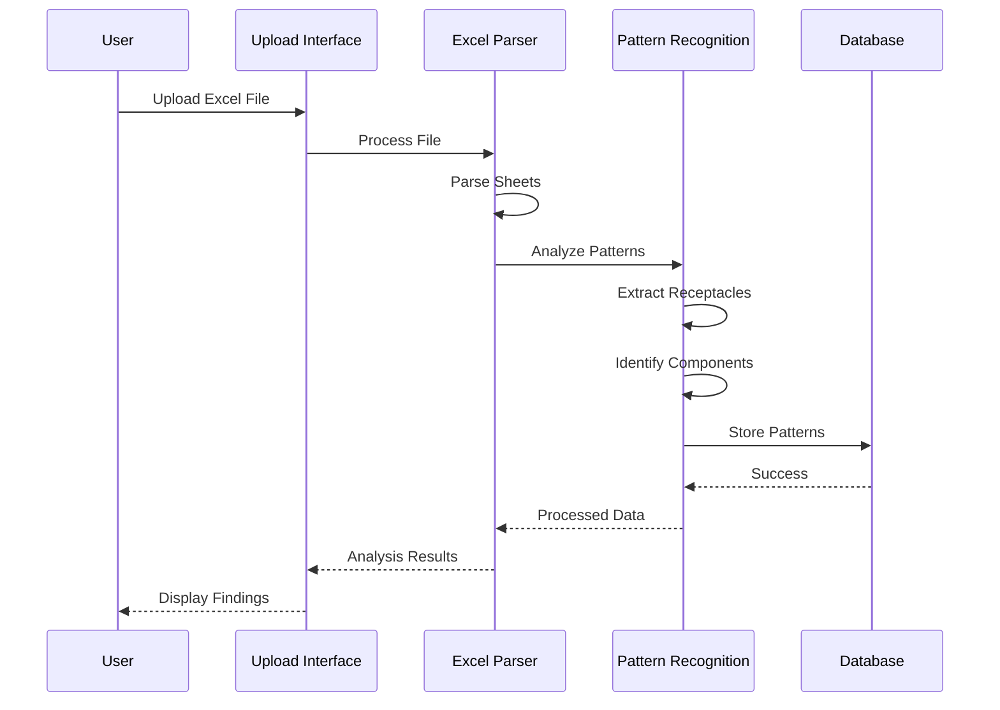
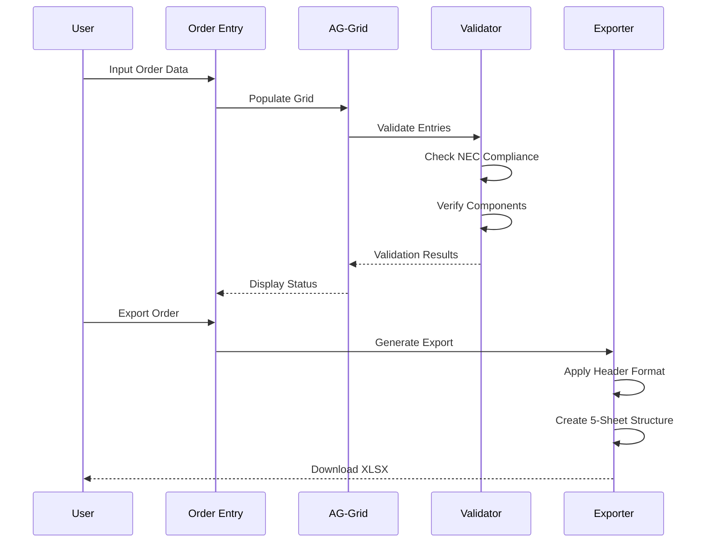

# ⚡ Power Whip Configuration Tool

[](https://opensource.org/licenses/MIT)
[](https://nodejs.org/)
[](https://reactjs.org/)
[](https://www.typescriptlang.org/)

A comprehensive full-stack web application designed for electrical engineers and technicians to configure, design, and manage custom electrical power whip assemblies with advanced Excel integration, component libraries, and automated export capabilities.


---

## 🚀 Features Overview

### Core Capabilities
- **🎨 Visual Design Canvas**: Drag-and-drop interface for electrical component placement
- **📊 Excel Integration**: Advanced parsing, transformation, and export of electrical data
- **🔧 Component Library**: 50+ electrical components with full specification editing
- **📋 Order Management**: Professional order entry with AG-Grid interface
- **🔄 Pattern Recognition**: AI-powered pattern detection in Excel files
- **📄 Export System**: Multi-format exports (XLSX, PDF) with PreSal compatibility
- **🎯 Movable Panels**: Flexible UI with draggable, resizable panels
- **⚡ Real-time Validation**: NEC compliance and electrical code checking

---

## 🏗️ System Architecture

### Frontend Stack
```
React 18 + TypeScript
├── UI Framework: shadcn/ui (Radix UI)
├── Styling: Tailwind CSS
├── State Management: TanStack Query + React Context
├── Routing: Wouter
├── Forms: React Hook Form + Zod
└── Build Tool: Vite
```

### Backend Stack
```
Node.js + Express.js
├── Database: PostgreSQL (Neon Serverless)
├── ORM: Drizzle ORM
├── Validation: Zod Schemas
├── Session: Express Sessions
└── File Processing: xlsx, papaparse
```

### Database Schema
```sql
powerWhipConfigurations  -- Main configurations
├── electricalComponents -- Component library
├── excelFormulaLibrary  -- Reusable Excel formulas
├── excelPatternLibrary  -- Pattern recognition data
├── excelFileArchive     -- Uploaded file metadata
└── componentDataSources -- Multi-source data integration
```

---

## 📊 Application Flow Diagram



---

## 🔄 Module Workflows

### 1. Component Library Workflow



**Supported Edits by Component Type:**
- **Connectors & Receptacles**: Name, Voltage, Current, Wire Gauge, Price
- **Protection Devices**: Voltage, Current, Price
- **Wire Components**: Wire Gauge, Price
- **Junction Boxes & Conduit**: Price Only

### 2. Design Canvas Workflow



**Design Canvas Features:**
- **Spatial Grouping**: 150px proximity threshold for component relationships
- **Priority Detection**: Connector/receptacle detection triggers new rows
- **Export Parsing**: Sophisticated rules for PreSal format generation

### 3. Excel Integration Workflow



**Pattern Recognition Capabilities:**
- **Multi-Sheet Analysis**: Scans all sheets regardless of name
- **Receptacle Detection**: NEMA, IEC, L-series pattern matching
- **Component Mapping**: Cable, conduit, length identification
- **Duplicate Handling**: Comprehensive pattern capture with deduplication

### 4. Order Entry Workflow



---

## 🛠️ How to Use

### Getting Started

1. **Installation & Setup**
   ```bash
   git clone <repository-url>
   cd power-whip-configuration-tool
   npm install
   ```

2. **Environment Configuration**
   ```bash
   # Set up PostgreSQL database
   # Configure environment variables
   npm run db:push
   ```

3. **Start Development Server**
   ```bash
   npm run dev
   # Application runs on http://localhost:5000
   ```

### Module Usage Guide

#### 🔧 Component Library Module

**Purpose**: Manage and customize electrical components

**How to Use:**
1. **Browse Components**: Use the accordion interface to explore categories
2. **Edit Specifications**: Click on any badge/field to edit:
   - **Name**: Click component title (connectors/receptacles only)
   - **Voltage**: Click voltage badge (125V → 240V)
   - **Current**: Click amp badge (15A → 20A) 
   - **Wire Gauge**: Click AWG badge (12 AWG → 10 AWG)
   - **Price**: Click price display ($12.50 → $15.99)
3. **Create Variants**: Each edit creates a new permanent component
4. **Add to Canvas**: Click the ⚡ button to add components to design

**Key Features:**
- Real-time component creation
- Category-specific editing permissions
- Hover states with edit indicators
- Keyboard shortcuts (Enter/Escape)

#### 🎨 Design Canvas Module

**Purpose**: Visual design and spatial arrangement of electrical components

**How to Use:**
1. **Add Components**: Drag from Component Library or click ⚡ button
2. **Position Elements**: Drag components to desired locations
3. **Group Related Items**: Place related components within 150px for auto-grouping
4. **Export Design**: Click "Export Design Canvas" for XLSX generation

**Export Features:**
- **Spatial Parsing**: Components grouped by proximity
- **Priority Rules**: Connectors/receptacles trigger new rows
- **PreSal Format**: Professional 50+ column structure
- **5-Sheet Export**: Complete documentation package

#### 📊 Excel Integration Module

**Purpose**: Process and analyze Excel files for component data

**How to Use:**
1. **Upload Files**: Drag & drop or browse for .xlsx files
2. **Pattern Analysis**: Automatic detection of electrical patterns
3. **Data Extraction**: View parsed components and specifications
4. **Transform Data**: Convert patterns to structured format

**Supported Patterns:**
- **NEMA Standards**: 460C9W, 460R9W, 5-20R, L6-30R
- **IEC Pin & Sleeve**: CS8269A series
- **Cable Types**: MMC, LFMC, FMC, SO, MC, EMT
- **Custom Patterns**: User-defined electrical specifications

#### 📋 Order Entry Module

**Purpose**: Professional order management with validation

**How to Use:**
1. **Data Input**: Enter order details in AG-Grid interface
2. **Validation**: Real-time NEC compliance checking
3. **Component Lookup**: Auto-populate from component library
4. **Export Orders**: Generate professional order documentation

**AG-Grid Features:**
- **Excel-like Interface**: Familiar spreadsheet experience
- **Cell Editing**: Click-to-edit with validation
- **Sorting & Filtering**: Advanced data management
- **Copy/Paste**: Bulk data operations

### 🎯 Panel Management

**Movable Panel System:**
- **Drag Panels**: Click title bar and drag anywhere
- **Resize**: Use corner handles to adjust size
- **Minimize/Maximize**: Click panel controls
- **Reset Layout**: Use header controls to restore defaults

---

## 📁 Project Structure

```
power-whip-configuration-tool/
├── client/                     # Frontend React application
│   ├── src/
│   │   ├── components/         # React components
│   │   │   ├── ExpandedComponentLibrary.tsx  # Main component browser
│   │   │   ├── DesignCanvas.tsx              # Visual design interface
│   │   │   ├── ConfiguratorDatasetAnalyzer.tsx # Excel analysis
│   │   │   ├── AGGridOrderEntry.tsx          # Order management
│   │   │   └── DraggablePanel.tsx           # Panel system
│   │   ├── contexts/           # React contexts
│   │   ├── hooks/             # Custom hooks
│   │   ├── lib/               # Utilities
│   │   └── types/             # TypeScript types
├── server/                     # Backend Express application
│   ├── routes.ts              # API endpoints
│   ├── storage.ts             # Data storage layer
│   ├── excelParser.ts         # Excel processing
│   ├── designCanvasExport.ts  # Export functionality
│   └── db.ts                  # Database connection
├── shared/                     # Shared types and schemas
│   └── schema.ts              # Drizzle ORM schemas
└── docs/                      # Documentation
```

---

## 🔧 API Endpoints

### Component Management
```http
GET    /api/components                    # List all components
GET    /api/components/type/:type         # Filter by component type
GET    /api/components/:id               # Get specific component
POST   /api/components                   # Create new component
```

### Configuration Management
```http
GET    /api/configurations               # List configurations
POST   /api/configurations               # Create configuration
PUT    /api/configurations/:id           # Update configuration
DELETE /api/configurations/:id           # Delete configuration
```

### Excel Processing
```http
POST   /api/excel/upload                 # Upload Excel file
POST   /api/excel/transform              # Transform patterns
GET    /api/excel/components             # Get parsed components
```

### Export Operations
```http
POST   /api/export/xlsx/:id              # Export configuration to XLSX
POST   /api/export/pdf/:id               # Export configuration to PDF
POST   /api/export/design-canvas         # Export design canvas
```

---

## 🚀 Deployment

### Development
```bash
npm run dev          # Start development server
npm run check        # TypeScript type checking
npm run db:push      # Push database schema changes
```

### Production
```bash
npm run build        # Build for production
npm start           # Start production server
```

### Environment Variables
```bash
DATABASE_URL=        # PostgreSQL connection string
NODE_ENV=           # development/production
SESSION_SECRET=     # Session encryption key
```

---

## 🔄 Performance Features

### Optimization Strategies
- **Virtualized Rendering**: react-window for large datasets
- **Intelligent Caching**: 5-minute Excel parsing cache
- **Pre-compiled Patterns**: Optimized regex for pattern matching
- **Memoization**: React.memo for expensive components
- **Lazy Loading**: Dynamic imports for large modules

### Performance Metrics
- **Excel Processing**: <5 seconds (cached), <100ms (natural language)
- **Pattern Recognition**: <50ms for comma-delimited patterns
- **Component Rendering**: Virtualized for 1000+ items
- **Export Generation**: <2 seconds for complex designs

---

## 🧪 Testing & Quality

### Code Quality
- **TypeScript**: Full type safety across frontend/backend
- **Zod Validation**: Runtime type checking and validation
- **ESLint**: Code style and error detection
- **Shared Schemas**: Consistent types between client/server

### Browser Support
- **Modern Browsers**: Chrome 90+, Firefox 88+, Safari 14+
- **Mobile Responsive**: Touch-optimized interactions
- **Dark/Light Theme**: System preference detection

---

## 📚 Key Technologies

### Frontend
- **React 18**: Latest React with concurrent features
- **shadcn/ui**: Modern component library built on Radix UI
- **TanStack Query**: Powerful server state management
- **AG-Grid**: Professional data grid for Excel-like experience
- **Framer Motion**: Smooth animations and transitions

### Backend
- **Express.js**: Fast, minimalist web framework
- **Drizzle ORM**: Type-safe database operations
- **Neon Serverless**: Serverless PostgreSQL database
- **Zod**: Schema validation library

### Excel Processing
- **xlsx**: Excel file parsing and generation
- **papaparse**: CSV parsing capabilities
- **formula-parser**: Excel formula evaluation

---

## 🤝 Contributing

### Development Guidelines
1. **Code Style**: Follow TypeScript best practices
2. **Components**: Use shadcn/ui components when possible
3. **State Management**: TanStack Query for server state, Context for local state
4. **Validation**: Zod schemas for all data validation
5. **Performance**: Consider virtualization for large datasets

### Commit Guidelines
```bash
feat: add new component editing feature
fix: resolve Excel parsing issue
docs: update README with new workflows
style: improve component library layout
perf: optimize pattern recognition performance
```

---

## 📄 License

This project is licensed under the MIT License - see the [LICENSE](LICENSE) file for details.

---

## 🆘 Support

For questions, issues, or feature requests:

1. **Documentation**: Check this README and inline code comments
2. **Issues**: Create GitHub issues for bugs or feature requests
3. **Discussions**: Use GitHub Discussions for questions

---

**Built with ⚡ by electrical engineers, for electrical engineers.**