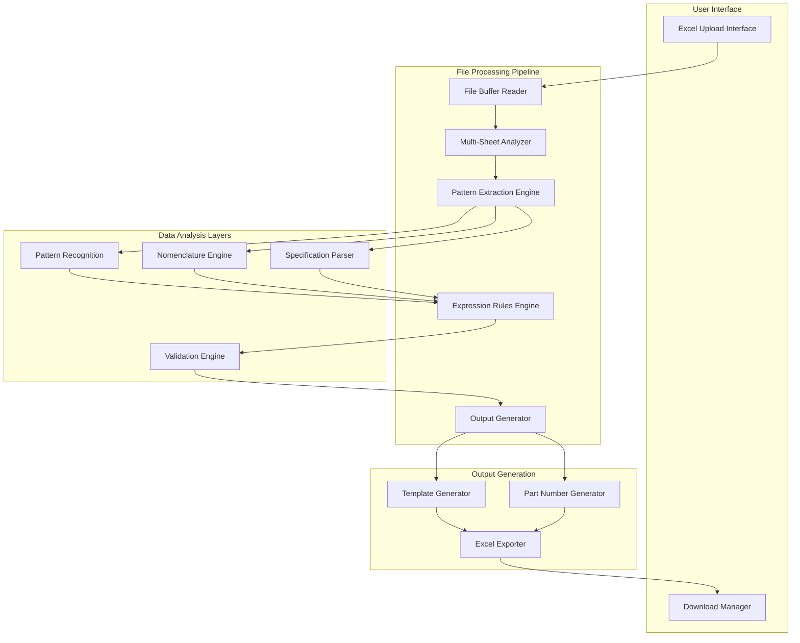
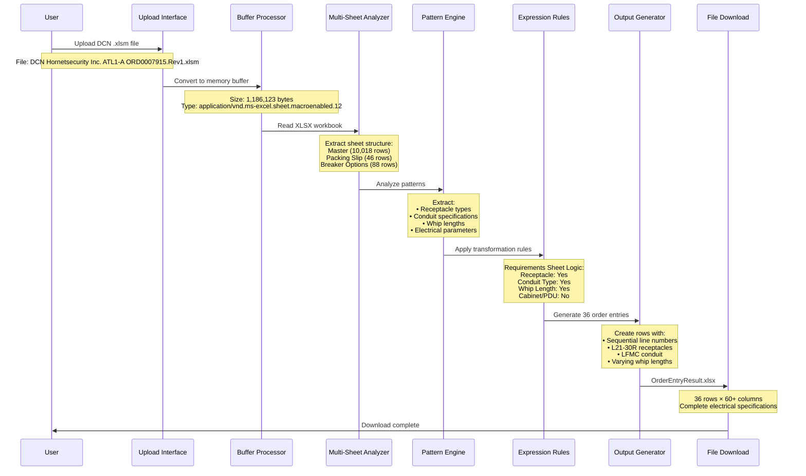
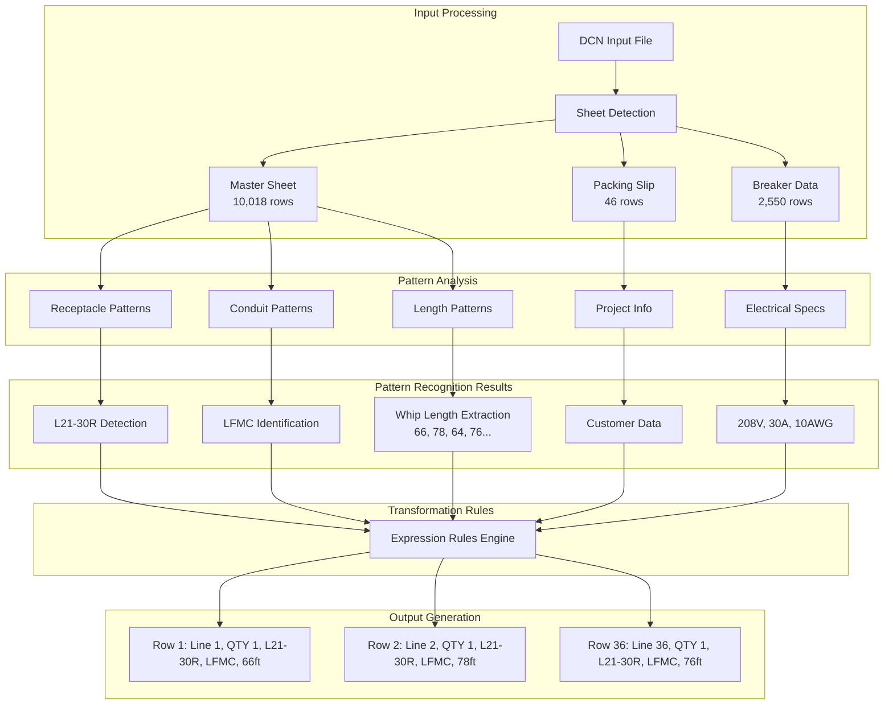
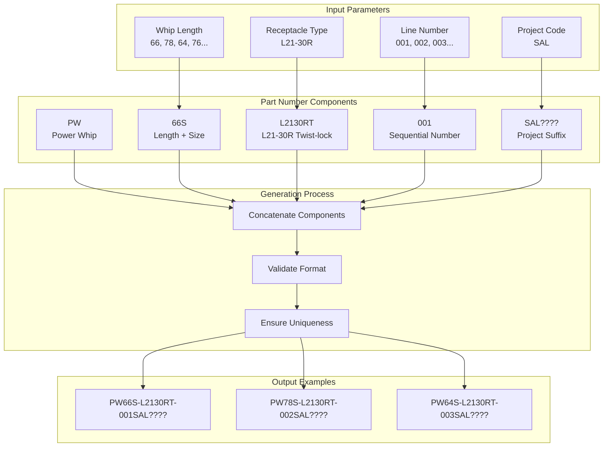
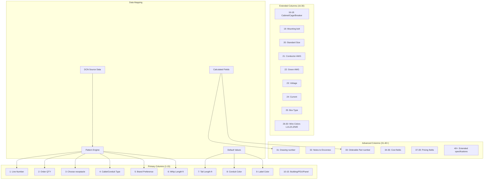
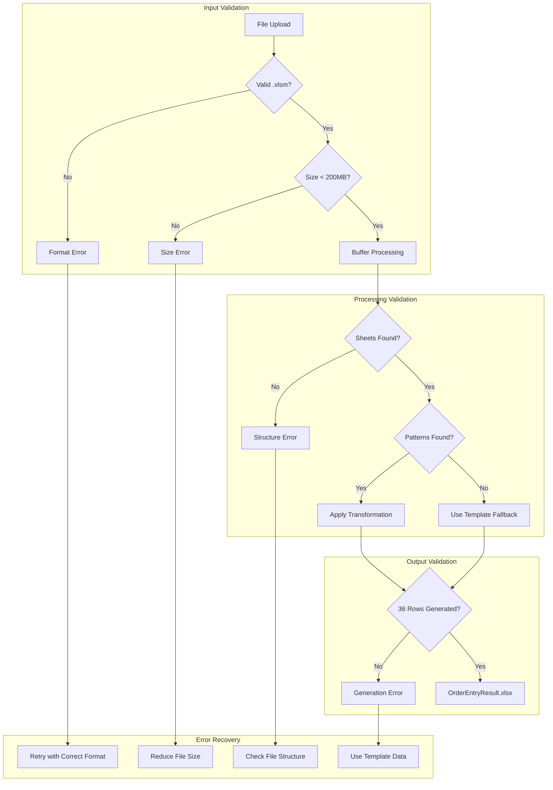
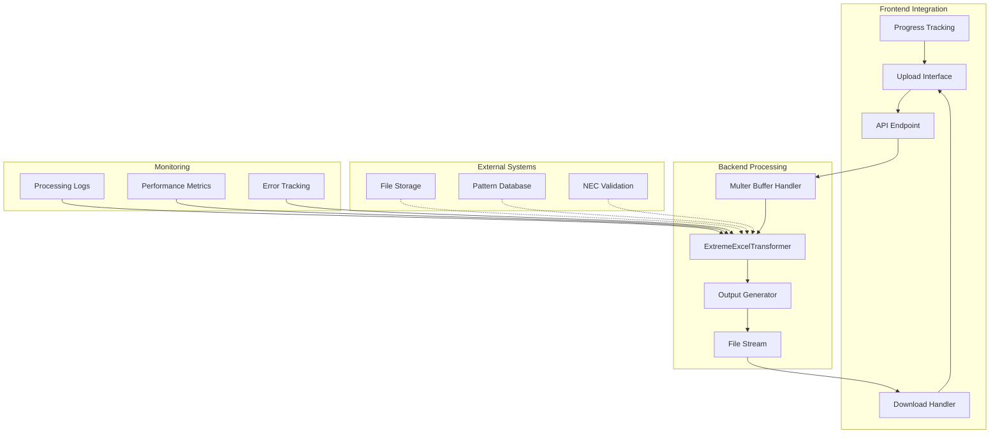

# DCN Processing Visual Guide

## System Overview Diagram



## DCN Transformation Detailed Flow



## Pattern Recognition Workflow



## Data Structure Transformation

```mermaid
graph LR
    subgraph "DCN Input Structure"
        DCN_MASTER[Master Sheet<br/>• Raw electrical data<br/>• Component specifications<br/>• Unstructured format]
        DCN_PACK[Packing Slip<br/>• Project information<br/>• Customer details<br/>• Order metadata]
        DCN_BREAK[Breaker Data<br/>• Circuit protection<br/>• Electrical ratings<br/>• Safety parameters]
    end
    
    subgraph "Pattern Engine Processing"
        EXTRACT[Pattern Extraction<br/>• Receptacle: L21-30R<br/>• Conduit: LFMC<br/>• Lengths: 50-150ft]
        NORMALIZE[Data Normalization<br/>• Standardize terms<br/>• Validate specifications<br/>• Apply defaults]
        MULTIPLY[Row Multiplication<br/>• Generate 36 variants<br/>• Sequential numbering<br/>• Unique part numbers]
    end
    
    subgraph "OrderEntryResult Structure"
        HEADERS[Column Headers<br/>Order QTY | Choose receptacle | Cable/Conduit Type<br/>Brand Preference | Whip Length | Tail Length]
        ROW_DATA[Data Rows (36)<br/>1 | L21-30R | LFMC | Best Value | 66 | 6<br/>2 | L21-30R | LFMC | Best Value | 78 | 6<br/>... (34 more rows)]
        EXTENDED[Extended Columns (60+)<br/>Electrical specs | Part numbers | Costs<br/>Wire colors | Box specifications | Compliance]
    end
    
    DCN_MASTER --> EXTRACT
    DCN_PACK --> EXTRACT
    DCN_BREAK --> EXTRACT
    
    EXTRACT --> NORMALIZE
    NORMALIZE --> MULTIPLY
    
    MULTIPLY --> HEADERS
    MULTIPLY --> ROW_DATA
    MULTIPLY --> EXTENDED
```

## Part Number Generation Logic



## Column Mapping Visualization



## Processing Performance Metrics

```mermaid
gantt
    title DCN File Processing Timeline
    dateFormat X
    axisFormat %s
    
    section File Upload
    Buffer Read          :0, 100
    
    section Analysis
    Sheet Detection      :100, 200
    Pattern Recognition  :200, 800
    Data Extraction      :800, 1200
    
    section Transformation  
    Rule Application     :1200, 1400
    Row Generation       :1400, 1600
    Part Number Gen      :1600, 1700
    
    section Output
    Excel Generation     :1700, 1900
    File Download        :1900, 2000
```



**Performance Benchmarks:**
- **File Processing**: < 2 seconds total
- **Pattern Recognition**: ~600ms 
- **Row Generation**: ~300ms (36 rows)
- **Excel Output**: ~200ms
- **Memory Usage**: Buffer-only (no disk I/O)

## Error Handling Flow



## System Integration Points

